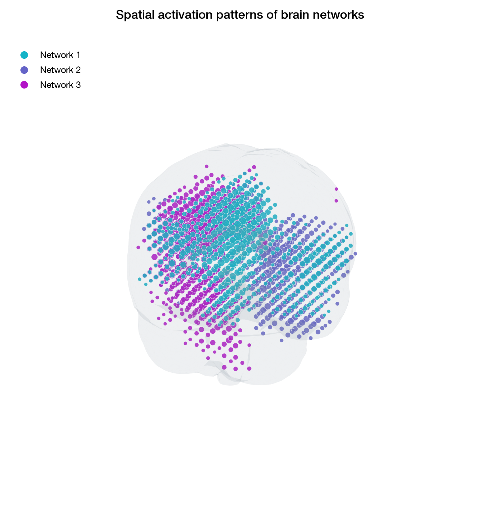

# BROADNESS for Python

This directory contains the modular Python implementation of the BROADNESS
toolbox. The MATLAB implementation remains unchanged in the parent directory.

Each public MATLAB function will have one corresponding Python module and
function. There will be no all-in-one pipeline: users will call only the
individual BROADNESS functions required for their analysis.

## Environment setup

From this directory, create and activate the dedicated environment:

```text
conda env create --file environment.yml
conda activate broadness
```

Run the tests with:

```text
pytest
```

## Indexing convention

Public arguments that select components or participants use one-based numbers
for consistency with the MATLAB toolbox, scientific figures, and publications.
Direct NumPy array indexing follows the standard Python zero-based convention.

## Spatial-pattern visualization

The three-dimensional spatial-pattern plot places the original source-level
network activations inside a smooth 1-mm MNI152 brain surface. The anatomical
surface improves visual context without interpolating or changing the spatial
resolution of the estimated networks.



## Data policy

Participant data, MATLAB data files, and generated analysis outputs must remain
local and must never be committed to the repository. The package contains only
one small anatomical visualization asset: a 92-KB surface mesh derived from the
1-mm MNI152 brain template. It contains surface geometry rather than participant
or experimental data and allows the 3D visualizer to load the anatomical shell
without distributing or repeatedly processing the full template volume.
